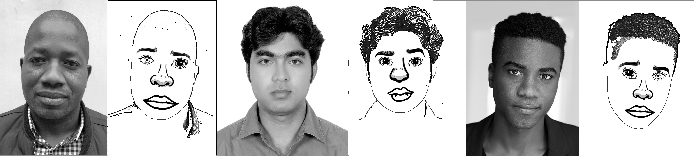

# Generation of Facial Cartoons
An exploration of the use of different computer vision techniques to generate facial cartoons from real images.

## Examples


## To run main program for one image:
- Install requirements listed in _requirements.txt_
```
$ python -m main <image_path> <data_dir_path>
```
e.g.
```
$ python -m main .\data\test-set\face-images\level-1\03-Rosin.png .\data\
```
